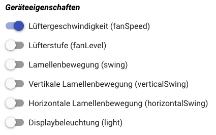
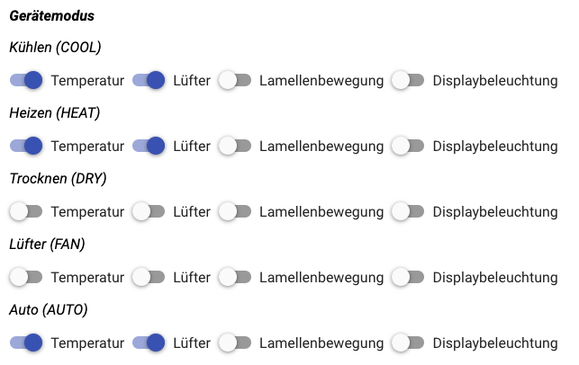
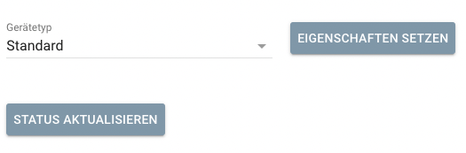
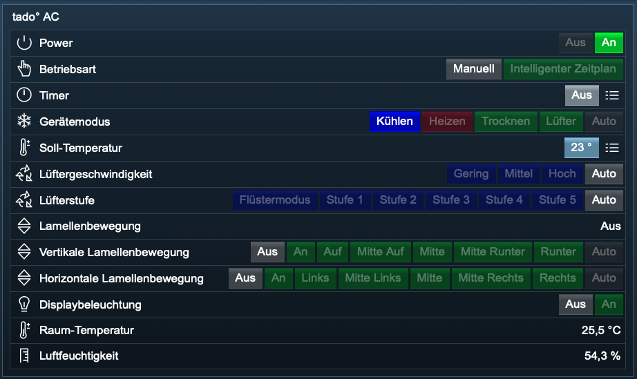

# AC (Klimaanlage)

Mit diesem Modul kann eine Klimaanlage smart gesteuert werden. 

Für dieses Modul besteht kein Anspruch auf Fehlerfreiheit, Weiterentwicklung, sonstige Unterstützung oder Support.  
Bevor das Modul installiert wird, sollte unbedingt ein Backup von IP-Symcon durchgeführt werden.  
Der Entwickler haftet nicht für eventuell auftretende Datenverluste oder sonstige Schäden.  
Der Nutzer stimmt den oben angegebenen Bedingungen, sowie den Lizenzbedingungen ausdrücklich zu.  

### Inhaltsverzeichnis

1. [Funktionsumfang](#1-funktionsumfang)
2. [Voraussetzungen](#2-voraussetzungen)
3. [Software-Installation](#3-software-installation)
4. [Einrichten der Instanzen in IP-Symcon](#4-einrichten-der-instanzen-in-ip-symcon)
5. [Statusvariablen und Profile](#5-statusvariablen-und-profile)
6. [WebFront](#6-webfront)
7. [PHP-Befehlsreferenz](#7-php-befehlsreferenz)

### 1. Funktionsumfang

* Klimaanlage aus- und einschalten
* Betriebsart schalten
* Timer schalten
* Gerätemodus schalten
* Soll-Temperatur anpassen
* Lüftergeschwindigkeit schalten
* Lüfterstufe schalten
* Lamellenbewegung aus- und einschalten
* Vertikale Lamellenbewegung schalten
* Horizontale Lamellenbewegung schalten
* Anzeigenlicht aus- und einschalten
* Raumtemperatur anzeigen
* Luftfeuchtigkeit anzeigen

### 2. Voraussetzungen

- IP-Symcon ab Version 6.1

### 3. Software-Installation

* Bei kommerzieller Nutzung (z.B. als Einrichter oder Integrator) wenden Sie sich bitte zunächst an den Autor.
* Bei privater Nutzung wird das `tado° Modul` über den Module-Store installiert.

### 4. Einrichten der Instanzen in IP-Symcon

Unter `Instanz hinzufügen` kann die `tado° AC` Instanz mithilfe des Schnellfilters gefunden werden.  
Alternativ kann der `tado° Configurator` zur automatischen Einrichtung verwendet werden.  
Weitere Informationen zum Hinzufügen von Instanzen in der [Dokumentation der Instanzen](https://www.symcon.de/service/dokumentation/konzepte/instanzen/#Instanz_hinzufügen)  

__Konfigurationsseite__:

***Geräteinformationen:***

| Name                                           | Beschreibung                 |
|------------------------------------------------|------------------------------|
| Gerät:                                         |                              |
| Zuhause ID                                     | Zuhause ID                   |
| Zuhause Name                                   | Zuhause Name                 |
| Raum ID                                        | Raum ID                      |
| Raum Name                                      | Raum Name                    |
| Raum Typ                                       | Raum Typ                     |
| Aktualisierungsintervall                       | Aktualisierungsintervall     |

***Geräteeigenschaften:***

  

| Name                                           | Beschreibung                 |
|------------------------------------------------|------------------------------|
| Lüftergeschwindigkeit (fanSpeed)               | Lüftergeschwindigkeit        |
| Lüfterstufe (fanLevel)                         | Lüfterstufe                  |
| Lamellenbewegung (swing)                       | Lamellenbewegung             |
| Vertikale Lamellenbewegung (verticalSwing)     | Vertikale Lamellenbewegung   |
| Horizontale Lamellenbewegung (horizontalSwing) | Horizontale Lamellenbewegung |
| Licht (light)                                  | Anzeigenbeleuchtung          |

Auswählen der verfügbaren Eigenschaften des Gerätes.  

***Gerätemodus:***



Auswahl, welche Parameter für den jeweiligen Modus genutzt werden.  

| Name     | Beschreibung                                             |
|----------|----------------------------------------------------------|
| Kühlen   | Temperatur, Lüfter, Lamellenbewegung, Displaybeleuchtung |
| Heizen   | Temperatur, Lüfter, Lamellenbewegung, Displaybeleuchtung |
| Trocknen | Temperatur, Lüfter, Lamellenbewegung, Displaybeleuchtung |
| Lüfter   | Temperatur, Lüfter, Lamellenbewegung, Displaybeleuchtung |
| Auto     | Temperatur, Lüfter, Lamellenbewegung, Displaybeleuchtung |

Die Eigenschaften und den damit verbundenen Funktionsumfang kann je nach Gerät unterschiedlich sein.  
Schauen Sie in der `tado° App` nach, welche Funktionen die Klimaanlage unterstützt oder  
wählen Sie eine bereits vorhandene Konfiguration aus:



Alternative können Sie auch die Eigenschaften auf Funktion ausprobieren.

### 5. Statusvariablen und Profile

Die Statusvariablen/Kategorien werden automatisch angelegt. Das Löschen einzelner kann zu Fehlfunktionen führen.

#### Statusvariablen

| Name                | Typ     | Beschreibung                     | Werte                                                |
|---------------------|---------|----------------------------------|------------------------------------------------------|
| Power               | boolean | Aus - Ein                        | false = Aus, true = Ein                              |
| OperationMode       | boolean | Manuell - Intelligenter Zeitplan | false = Manuell, true = Intelligenter Zeitplan       |
| CoolingTimer        | integer | Timer                            | 0, 1 , 300 bis 43200                                 |
| DeviceMode          | string  | Gerätemodus                      | COOL, HEAT, DRY, FAN, AUTO                           |
| SetpointTemperature | float   | Solltemperatur                   | 0, 15 bis 30                                         |
| FanSpeed            | string  | Lüftergeschwindigkeit            | LOW, MIDDLE, HIGH, AUTO                              |
| FanLevel            | string  | Lüfterstufe                      | SILENT, LEVEL1, LEVEL2, LEVEL3, LEVEL4, LEVEL5, AUTO |
| Swing               | boolean | Lamellenbewegung Aus - Ein       | false = Aus, true = Ein                              |
| VerticalSwing       | string  | Vertikale Lamellenbewegung       | OFF, ON, UP, MID_UP, MID, MID_DOWN, DOWN, AUTO       |
| HorizontalSwing     | string  | Horizontale Lamellenbewegung     | OFF, ON, LEFT, MID_LEFT, MID, MID_RIGHT, RIGHT, AUTO |
| DisplayLight        | boolean | Anzeigenbeleuchtung Aus - Ein    | false = Aus, true = Ein                              |
| RoomTemperature     | float   | Raumtemperatur                   | aktuelle Raumtemperatur                              |
| AirHumidity         | float   | Luftfeuchtigkeit                 | aktuelle Luftfeutigkeit                              |                                                 

#### Profile

| Name                                 | Typ     | Werte                                                |
|--------------------------------------|---------|------------------------------------------------------|
| TADOAC.InstanzID.OperationMode       | boolean | false = Manuell, true = Intelligenter Zeitplan       |
| TADOAC.InstanzID.CoolingTimer        | integer | 0, 1 , 300 bis 43200                                 | 
| TADOAC.InstanzID.DeviceMode          | string  | COOL, HEAT, DRY, FAN, AUTO                           |
| TADOAC.InstanzID.SetpointTemperature | float   | 0, 15 bis 30                                         |
| TADOAC.InstanzID.FanSpeed            | string  | LOW, MIDDLE, HIGH, AUTO                              |
| TADOQC.InstanzID.FanLevel            | string  | SILENT, LEVEL1, LEVEL2, LEVEL3, LEVEL4, LEVEL5, AUTO |
| TADOQC.InstanzID.VerticalSwing       | string  | OFF, ON, UP, MID_UP, MID, MID_DOWN, DOWN, AUTO       |
| TADOQC.InstanzID.HorizontalSwing     | string  | OFF, ON, LEFT, MID_LEFT, MID, MID_RIGHT, RIGHT, AUTO |


Wird die Instanz gelöscht, so werden die Profile automatisch gelöscht.  

### 6. WebFront



* Klimaanlage aus- und einschalten
* Betriebsart schalten
* Timer schalten
* Gerätemodus schalten
* Soll-Temperatur anpassen
* Lüftergeschwindigkeit schalten
* Lüfterstufe schalten
* Lamellenbewegung aus- und einschalten
* Vertikale Lamellenbewegung schalten
* Horizontale Lamellenbewegung schalten
* Anzeigenlicht aus- und einschalten
* Raumtemperatur anzeigen
* Luftfeuchtigkeit anzeigen

### 7. PHP-Befehlsreferenz

```text
Klimaanlage aus oder einschalten:

void TADOAC_TogglePower(integer $InstanceID, boolean $State);  
Dieser Befehl liefert keinen Rückgabewert. 

$State:
false   = OFF   | Aus
true    = ON    | Ein

Beispiel:
TADOAC_TogglePower(12345, false);
```  

```text
Betriebsart einstellen:

void TADOAC_ToggleOperationMode(integer $InstanceID, boolean $Mode);  
Dieser Befehl liefert keinen Rückgabewert. 

$Mode:
false   = Manuell
true    = Automatik

Beispiel:
TADOAC_ToggleOperationMode(12345, false);
```  

```text
Timer einstellen:

void TADOAC_SetCoolingTimer(integer $InstanceID, integer $Duration);  
Dieser Befehl liefert keinen Rückgabewert. 

$Duration:
0       = unendlich
1       = bis zum nächsten Schaltpunkt
>300    = Dauer in Sekunden

Beispiel:
TADOAC_SetCoolingTimer(12345, 3600);
```  

```text
Gerätemodus der Klimaanlage einstellen:

TADOAC_ToggleDeviceMode(integer $InstanceID, string $Mode);  
Dieser Befehl liefert keinen Rückgabewert. 

$Mode:
COOL    | Kühlen
HEAT    | Heizen
DRY     | Trocknen
FAN     | Lüften
AUTO    | Automatik

Beispiel:
TADOAC_ToggleDeviceMode(12345, 'COOL');
```  

```text
Temperatur einstellen:

void TADOAC_SetCoolingTemperature(integer $InstanceID, float $Temperature);  
Dieser Befehl liefert keinen Rückgabewert. 

Beispiel:
TADOAC_SetCoolingTemperature(12345, 15.5);
```  

```text
Lüftergeschwindigkeit einstellen:

void TADOAC_SetFanSpeed(integer $InstanceID, string $Speed);  
Dieser Befehl liefert keinen Rückgabewert. 

$Speed:
LOW     | Gering
MIDDLE  | Mittel
HIGH    | Hoch
AUTO    | Automatik

Beispiel:
TADOAC_SetFanSpeed(12345, 'HIGH');
```  

```text
Lüfterstufe einstellen:

void TADOAC_SetFanLevel(integer $InstanceID, string $Speed);  
Dieser Befehl liefert keinen Rückgabewert. 

$Speed:
SILENT  | Ruhig
LEVEL1  | Stufe 1
LEVEL2  | Stufe 2
LEVEL3  | Stufe 3
LEVEL4  | Stufe 4
LEVEL5  | Stufe 5
AUTO    | Automatik

Beispiel:
TADOAC_SetFanLevel(12345, 'LEVEL2');
```  

```text
Lamellenbewegung aus oder einschalten:

void TADOAC_SetSwingState(integer $InstanceID, boolean $State);  
Dieser Befehl liefert keinen Rückgabewert. 

$State:
false   = OFF | Aus
true    = ON | An

Beispiel:
TADOAC_SetSwingState(12345, false);
```  

```text
Vertikale Lamellenbewegung schalten:

void TADOAC_SetVerticalSwingState(integer $InstanceID, string $State);  
Dieser Befehl liefert keinen Rückgabewert. 

$State:
OFF         | Aus
ON          | Ein
UP          | Hoch
MID_UP      | Mitte Hoch
MID         | Mitte
MID_DOWN    | Mitte Runter
DOWN        | Runter
AUTO        | Automatik

Beispiel:
TADOAC_SetVerticalSwingState(12345, 'MID_UP');
```  

```text
Horizontale Lamellenbewegung schalten:

void TADOAC_SetHorizontalSwingState(integer $InstanceID, string $State);  
Dieser Befehl liefert keinen Rückgabewert. 

$State:
OFF         | Aus
ON          | Ein
LEFT        | Links
MID_LEFT    | Mitte Links
MID         | Mitte
MID_RIGHT   | Mitte Rechts
RIGHT       | Rechts
AUTO        | Automatik

Beispiel:
TADOAC_SetHorizontalSwingState(12345, 'MID_UP');
```  

```text
Anzeigenbeleuchtung aus oder einschalten:

void TADOAC_ToggleDisplayLight(integer $InstanceID, boolean $State);  
Dieser Befehl liefert keinen Rückgabewert. 

$State:
false   = OFF   | Aus
true    = ON    | Ein

Beispiel:
TADOAC_ToggleDisplayLight(12345, false);
```

```text
Status aktualisieren:

TADOAC_UpdateCoolingZoneState(integer $InstanceID);  
Dieser Befehl liefert keinen Rückgabewert. 

Beispiel:
TADOAC_UpdateCoolingZoneState(12345);
```